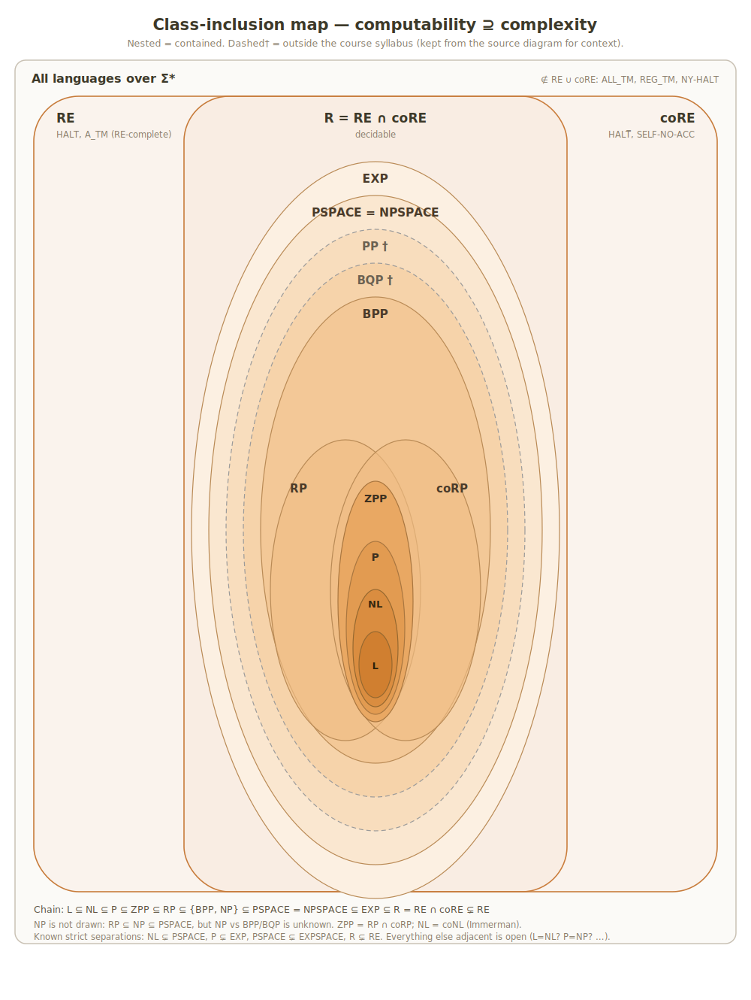

# Computability & Complexity — Ground-Truth Study Reference

Built from **all 51 unique files** in the `Complexity` folder (lectures 1–13, English recitations 1–13, Hebrew recitations 1–12, exercises 1–12, and the 82-page course summary). Course: מודלים חישוביים, חישוביות וסיבוכיות (HUJI 67521, 2025–2026 sem B).

**Notation used in this course:** ≤m = mapping reduction, ≤p = polynomial-time reduction, ≤L = log-space reduction. "Decides" = halts on every input with the right answer; "recognizes" = accepts exactly L, may loop on non-members.

*Full class-inclusion map: randomized classes (per the standard diagram, incl. PP/BQP for context) nested inside PSPACE ⊆ EXP ⊆ R = RE ∩ coRE, with L ⊆ NL ⊆ P at the core. NP is deliberately not drawn (RP ⊆ NP ⊆ PSPACE, but NP vs BPP is unknown).*

---

## The Master Table

| Entity | Belongs to / contained in | Contains | Purpose / use | Key things to know | Notes |
|---|---|---|---|---|---|
| **— MODELS OF COMPUTATION —** | | | | | |
| DFA — model | Decides exactly REG | States Q, alphabet Σ, δ: Q×Σ→Q, q₀, F | Simplest computation model; fixed memory, one left-to-right pass | 5-tuple ⟨Q,Σ,δ,q₀,F⟩; run on w = state sequence r₀…rₙ, accepts iff rₙ∈F; L(A) = {w : δ*(q₀,w)∈F} | To prove L(A)=L: characterize the words ending in each state, induct on |w|. Exam phrase: be ready to prove "at gunpoint" |
| δ* (extended transition function) — definition | Part of DFA/NFA formalism | — | Formalizes "run the whole word"; shortens definitions & proofs | DFA: δ*(q,ε)=q, δ*(q,w′σ)=δ(δ*(q,w′),σ). Key lemma: δ*(q,w·w′)=δ*(δ*(q,w),w′) (induct on |w′|). NFA version: δ*: 2^Q×Σ*→2^Q, δ*(S,ε)=S | The composition lemma is the workhorse of separating-suffix arguments |
| NFA — model | Recognizes exactly NREG = REG | Q, Σ, δ: Q×Σ→2^Q, **set** Q₀ of initial states, F | Nondeterminism = "guessing"; gives exponentially smaller automata | Accepts w iff **there exists** an accepting run. Runs may get stuck (δ can return ∅). Multiple initial states allowed in this course | L_k (kth letter from end is a): NFA with k+1 states, every DFA needs ≥2^k states (pigeonhole + suffix argument) |
| ε-transitions — model feature | NFA formalism | — | Convenience for constructions (concatenation, star) | Eliminate via E(q) = states reachable by ε-arrows: new δ(q,σ)=⋃_{q′∈E(q)}E(η(q′,σ)), new Q₀=⋃_{q∈P₀}E(q) | Formal NFA definition has **no** ε-transitions; a graph with them is shorthand |
| Turing machine (TM) — model | Recognizes RE; deciders give R | 7-tuple ⟨Σ,Γ,⌴,Q,q₀,F,δ⟩, δ:(Q∖F)×Γ→Q×Γ×{L,R} | The course's model of "algorithm" (Church–Turing) | Two-way infinite tape, read/write head. Configuration = tape + state + head position, written u q v. Run = sequence of successive configurations; halts iff reaches final state | Decision TM: F={q_acc,q_rej}. If it never halts, w is neither accepted nor rejected — the crux of RE vs R |
| TM procedures — technique | TM programming | Marking letters (enlarged Γ=Σ∪(Σ×{marks})), end-marker #, shift-right, copy, counters, binary +/−/× | Justify "high-level descriptions" of TMs | Standard costs: copy O(n²), a^n→binary O(n²) naive / O(n log n) smart, substring x#y in O(|x|·|y|), binary addition poly | Exams accept pseudocode built from seen procedures — but you must know how to implement each |
| Multi-tape TM — model | Equivalent to 1-tape TM | k tapes, δ:(Q∖F)×Γᵏ→Q×Γᵏ×{L,R}ᵏ | Simplifies constructions (parallel simulation, RE∪ closure) | Simulation on 1 tape: alphabet (Γ×Γ×{0,1}×{0,1}); t steps of 2-tape TM cost O(t²) on 1 tape; k tapes: O(f(n)) time → O(f(n)²) | Polynomial-time is model-robust: multi-tape poly ⇒ single-tape poly |
| Nondeterministic TM (NTM) — model | Defines NP, NSPACE classes | δ:(Q∖F)×Γ→2^{Q×Γ×{L,R}}, set Q₀ | Model behind NP: "guess and verify" | Accepts iff **some** run accepts. Runtime = length of **longest** run (alt definition: guess timer t, cut off). Space = max cells over all runs | Swapping q_acc/q_rej does NOT complement an NTM's language — rejection of one run means nothing |
| Universal TM (U) — machine | Exists; basis of A_TM∈RE, hierarchy proofs | — | Simulates any ⟨M,w⟩: interpreter | U(⟨M,w⟩) doesn't halt iff M(w) doesn't; else U(⟨M,w⟩)=⟨M(w)⟩; loop ⟨M⟩⟨C⟩→⟨M⟩⟨C⁺⟩. Simulation overhead: poly per step; can simulate f(n) steps in O(f(n)·log f(n)) with a step counter | The counting-steps construction M′(w)=M(w)#t costs O(t²) naive, O(t log t) with a movable counter (exercise 3/5) |
| TM encoding ⟨M⟩ — definition | Input format for TMs-as-data | Encodings of Σ,Γ,⌴,Q,q₀,F and each δ-rule ##(q)_b#(α)_b#(q′)_b#(β)_b#(D)_b## over {0,1,#,\|} | Enables running machines on machine descriptions | Invalid encodings are decidable to detect; conventionally mapped to "error set" E ∈ R | Handling invalid inputs is a required (easy) step in reduction correctness proofs |
| Log-space TM — model | Defines L, NL | 3 tapes: read-only input, O(log n) work tape, write-only one-way output tape | Makes sub-linear space meaningful | Only the **work tape** counts for space. Output head can't move left. #configurations = |Q|·O(log n)·n·|Γ|^{O(log n)} = poly(n) ⇒ L⊆P, NL⊆P | Composing two log-space functions is log-space: recompute g(x)'s letters on demand with counters (never store g(x)!) |
| Randomized TM — model | Defines ZPP, RP, coRP, BPP | Extra read-only coin tape, i.i.d. fair bits | Model for probabilistic algorithms (week 14) | Acceptance/time may depend on coins | Poly-time machine reads ≤ poly many coins ⇒ 2^{poly} coin strings (used in BPP⊆EXP) |
| **— LANGUAGE / AUTOMATA THEORY —** | | | | | |
| Alphabet, word, language — definitions | Foundation | Σ finite non-empty; Σ*=⋃Σⁿ; L⊆Σ* | Everything is a language question | Σ⁰={ε}; ε∉Σ. #words over Σ = ℵ₀; #languages = 2^{ℵ₀} > ℵ₀ = #TMs/Python programs ⇒ **undecidable problems exist** (counting argument, exercise 1 Q7 diagonalization) | Decision problems ↔ languages (bijection). ∅ ≠ {ε} |
| Concatenation & Kleene star — operations | Regular operations | L₁∘L₂={wz}, L⁰={ε}, L*=⋃_{k≥0}Lᵏ | Building languages; closure questions | {ε}∘L=L, L∘∅=∅. REG closed under ∪,∩,complement,∘,* (and reverse — exercise). NREG closure proofs: union = disjoint union of NFAs; concat = ε-arrows from F_A to Q₀_B; star = ε back-arrows + fresh start state | Regular expressions: every REG language is built from ∅,{ε},{a} by ∪,∘,* |
| REG — class | ⊆ R; = NREG | All DFA-decidable languages | The decidable-by-finite-memory class | Closed under all Boolean ops + ∘,*,reverse. Every regular L decidable in O(n) time & space by a TM (exercise 4 Q3) | Non-members proved via Myhill–Nerode (this course does **not** teach the pumping lemma) |
| NREG — class | = REG | NFA-recognizable languages | Halfway concept before determinization | REG⊆NREG trivial (DFA is an NFA); NREG⊆REG by subset construction | The exponential blowup 2^Q is **necessary** (L_k example) |
| Product automaton — construction | DFA closure proofs | Q×P states, ψ((q,p),α)=(δ(q,α),η(p,α)) | Decide L₁∪L₂ / L₁∩L₂ with one DFA | Accepting states: F×P ∪ Q×G for union; F×G for intersection. Correctness: ψ*((q₀,p₀),w)=(δ*(q₀,w),η*(p₀,w)) by induction | Also the trick behind L_EVEN = track (state, parity) — Q×{0,1} |
| Subset construction / determinization — method | NFA→DFA | DFA states = 2^Q, p₀=Q₀, α(S,σ)=⋃_{q∈S}δ(q,σ), G={S : S∩F≠∅} | Prove REG=NREG; also an *algorithm* | Key claim α*(S,w)=δ*(S,w) by induction. Acceptance-checking alternatives: full determinization O(2ⁿ|Σ|); brute-force runs O(n^{|w|}); **subset-construction simulation O(n²·|w|) — the good one** | Exam: simulate on a word, show S after each letter |
| Separating suffix — definition | Myhill–Nerode machinery | — | Lower bounds on DFA size; non-regularity | z separates x,y iff exactly one of xz,yz ∈ L. If x,y reach the same DFA state ⇒ no separating suffix (contrapositive: separating suffix ⇒ different states) | To show "≥ k states": exhibit k pairwise-separated words |
| Myhill–Nerode equivalence ∼_L — relation/theorem | Characterizes REG | Equivalence classes [x]_L | THE tool for minimality and non-regularity | x∼_L y iff no separating suffix. **Theorem:** L∈REG iff ∼_L has finitely many classes; #classes = #states of the minimal DFA; the DFA: states=classes, q₀=[ε], δ([w],α)=[wα], F={[w]:w∈L} (well-definedness must be checked!) | Infinitely many classes ⇒ L∉REG. Classic exam languages: aⁿbⁿ, #a(w)≥#b(w), 1^{n²}, 1^{n!}, 1^{2ⁿ} (all classes distinct!), 1^prime, aⁱbʲcᵏ with k=i·j |
| L_EVEN, L_mix, L_k, Prefix(L), L^R, f̂-preimage — example constructions | REG/NREG closure exercises | — | Template constructions | L_EVEN: product with parity. L_mix (interleave with guessed z): NFA η(q,σ)={δ(δ(q,α),σ):α∈Σ}. L^R∈NREG (reverse arrows, swap start/accept). Prefix(L): accept states = states from which F is reachable. Substitution f:Σ₁→Σ₂*: δ₁(q,σ)=δ₂*(q,f(σ)) | These constructions + their two-sided-containment correctness proofs are the exam pattern for automata questions |
| **— COMPUTABILITY —** | | | | | |
| R (decidable) — class | R = RE ∩ coRE; contains REG, P, EXP | HALT-bounded, all finite langs, … | Languages with always-halting deciders | Closed under complement (swap q_acc/q_rej), ∪, ∩, ∘, * (exercise 5). L∈R iff L and L̄ ∈ RE (run both recognizers in parallel/alternating steps) | "Decides" ⇒ total. R-complete under ≤m does not exist meaningfully: every **non-trivial** L is R-hard; R-complete = all non-trivial members of R (exercise 6 Q1) |
| RE (recognizable) — class | ⊋ R; A_TM is RE-complete | HALT, A_TM, ACC_ε, NONEMPTY_TM, … | Languages with recognizers (may loop on 'no') | Closed under ∪ (dovetail: run both for n=0,1,2,… steps), ∩ (sequential), ∘, * — **not** under complement. L∈RE and L≤m L̄ ⇒ L∈R | Dovetailing/iterative deepening ("for n: run M for n steps on all short inputs") is THE technique for RE membership |
| coRE — class | coRE={L : L̄∈RE}; R=RE∩coRE | non-HALT, SELF-NO-ACC, USELESS, EQ-type langs | Complements of recognizable | Picture: R = intersection, RE∖R (e.g., HALT), coRE∖R (e.g., HALT-bar), and languages outside both (e.g., ALL_TM, REG_TM, NY-HALT) | RE-hard ⇒ ∉coRE; coRE-hard ⇒ ∉RE; hard for both ⇒ outside RE∪coRE |
| HALT (HALT_TM) — language | RE∖R; RE-complete | — | The halting problem — anchor of undecidability | ∈RE via universal TM (make all final states accepting). ∉R by diagonalization: from decider D build E(⟨M⟩): if D says ⟨M,⟨M⟩⟩ halts → loop, else halt; run E(⟨E⟩) → contradiction both ways | Variants all in RE∖R: HALT_ε (empty input), HALT_bin (binary alphabet; exercise 6 Q6 reduces alphabet by letter-encoding), SELF-NO-ACC={⟨M⟩: M doesn't accept ⟨M⟩} is coRE-complete |
| A_TM — language | RE-complete (also under ≤p! exercise 7) | {⟨M,w⟩ : M accepts w} | Canonical RE-complete problem | RE-hard: for L∈RE with recognizer M_L, map x↦⟨M_L,x⟩. HALT≤m A_TM (M′ accepts also when M rejects) and A_TM≤m HALT (M′ loops instead of rejecting) | A_TM-bar is coRE-complete. A_TM is also NP-hard (exercise 10) — trivially, since a decider for anything nontrivial can absorb poly reductions |
| Bounded simulation ⟨M,w,k⟩ — language | ∈ R | {⟨M,w,k⟩ : M accepts w within k steps} | Shows bounding resources ⇒ decidable | Simulate k steps with universal TM + counter; always halts | Same idea: {(⟨M⟩,1ᵏ): M visits ≤k cells on ε} ∈ R (finitely many configs ⇒ loop detection!) — exercise 6 Q4d |
| NONEMPTY_TM / ALL_TM / REG_TM — languages | NONEMPTY∈RE∖R; ALL_TM, REG_TM ∉ RE∪coRE | ⟨M⟩ with L(M)≠∅ / =Σ* / ∈REG | Classify semantic properties of L(M) | HALT≤m NONEMPTY: f(⟨M,w⟩)=⟨T⟩ where T erases input, runs M on w, accepts if it halts. ALL_TM: HALT≤m (same T) shows ∉coRE; HALT-bar≤m via "run M on w for \|x\| steps, accept iff not halted yet" shows ∉RE. REG_TM: use accept-aⁿbⁿ-or-(M halts on w ⇒ accept everything) | The "**run M on w for \|x\| steps**" trick converts non-halting into an infinite language — memorize it |
| USELESS — language | coRE-complete | {⟨M⟩: some non-final state never reached on any input} | Example of coRE-completeness proof | ∈coRE: complement (USEFUL) ∈ RE by dovetailing over all inputs while tracking visited states. Hard: A_TM-bar ≤m USELESS via machine H that, if M accepts w, traverses all its own states (implemented with @@ tape markers) | Traversing-all-states gadget is a construction detail exams love |
| NY-HALT — language | RE-hard ∧ coRE-hard ⇒ ∉RE∪coRE | Y-HALT ∪ N-HALT (tagged halting + tagged non-halting) | Shows languages harder than both classes exist | Reductions: ⟨M,w⟩↦(⟨M,w⟩,Y) from HALT; ⟨M,w⟩↦(⟨M,w⟩,N) from non-HALT | Exercise 6 Q5: RE∪coRE (as a class C) is not closed under union and **has no complete language** |
| Reduction ≤m (mapping reduction) — method | Computability toolkit | Computable total f with x∈A ⟺ f(x)∈B | Transfer (un)decidability | **Reduction theorem:** A≤m B and B∈{R,RE,coRE} ⇒ A same; contrapositive spreads hardness. Transitive. A≤m B ⟺ Ā≤m B̄ (same f!). Two styles: "solve the problem" (only if source decidable!) vs "transfer the problem" (embed M,w into the output machine) | **Top pitfall:** defining f by cases on an undecidable condition ("if M halts output M_ALL else M_EMPTY") — f must be computable! Always argue computability |
| C-hard / C-complete — definitions | For C∈{R,RE,coRE} (≤m), {NP,coNP,PSPACE} (≤p), {NL} (≤L) | — | "Hardest in class" formalism | L C-hard: every K∈C reduces to L. Complete = hard + member. If L C-hard and L≤K then K C-hard. L RE-complete ⟺ L̄ coRE-complete | Know which reduction type each class uses! (≤m / ≤p / ≤L) |
| Diagonalization — method | Proof technique | — | HALT∉R, hierarchy theorems, #languages > #machines | Self-reference: feed ⟨M⟩ to a machine built from a hypothetical decider, flip the answer. Time-bounded version (A_self) gives the Time Hierarchy Theorem | Cantor-style: L={wₙ : wₙ∉Lₙ} differs from every Lₙ |
| Church–Turing thesis — thesis | Meta-statement | — | Every physical computation model ≃ TM | Extended version: with only polynomial slowdown ⇒ P is model-independent | Turing's application: DECIDABLE (provable-or-refutable claims) ∉ R, else HALT∈R (write "M doesn't halt on w", search all proofs) |
| Busy Beaver BB(n) — function | Not computable | Max #steps of a halting n-state binary TM on ε | Non-computability beyond decision problems | If BB computable, decide HALT_ε: compute t=BB(\|M\|), run M for t steps | BB(5)=47,176,870 (Marxen–Buntrock machine, recently proven optimal). Note: a *function*, not a language |
| **— COMPLEXITY: TIME —** | | | | | |
| TIME(f)/NTIME(f) — classes | Build P, NP, EXP… | — | Resource-bounded computation | Runtime of M = worst case over \|w\|≤n. NTM runtime = longest run. Deciders only | Definitions require the machine to always halt |
| P — class | L⊆NL⊆**P**⊆NP⊆PSPACE⊆EXP; P⊆ZPP∩BPP; P⊊EXP | 2-SAT, 2-COLOURING, CNF-TAUTOLOGY, CONNECTED, MST, SPATH, PATH, E_DFA… | "Efficient" = polynomial time | ⋃ₖTIME(nᵏ). Closed under ∪,∩,complement,∘,* (concatenation/star via **dynamic programming**, exercise 7 Q2). Model-independent (extended C-T thesis). Every non-trivial L∈anything is P-hard under ≤p (trivially) | RAM→TM costs only polynomial (no random access, pay a scan per step) |
| NP — class | P⊆NP⊆EXP (⊆R); NP=⋃ₖNTIME(nᵏ) | SAT, 3-SAT, CLIQUE, IS, VC, HAMPATH…, all of P | Problems with efficiently checkable certificates | **Two equivalent definitions**: poly NTM, or ∃ polynomial verifier V(w,c) (∀w∈L ∃c: acc; ∀w∉L ∀c: rej; time poly in \|w\|). Proof both directions: guess c / record the nondeterministic choices as c. Closed under ∪,∩,∘,* — NOT known for complement | NP⊆EXP: simulate all runs (or all certificates) — exercise 7 Q6. P=NP is open; to prove P=NP it suffices to put one NPC language in P |
| coNP — class | NP∩coNP ⊇ P; coNP-complete = complements of NPC | TAUTOLOGY, CNF-CONTRADICTION (UNSAT), CLIQUE-bar | Complements of NP; "no" certificates | L NP-hard ⟺ L̄ coNP-hard (same reduction). If some NP-hard L ∈ NP∩coNP (or coNP∩NPC≠∅) ⇒ NP=coNP. NP≠coNP ⇒ P≠NP | 3 world pictures: P=NP; P≠NP with NP=coNP; NP≠coNP. CNF-TAUTOLOGY∈P (each clause must be a tautology: contains x∨x̄) but general TAUTOLOGY is coNP-complete — the CNF form matters! |
| EXP (and E, NE, NEXP) — classes | P⊊EXP; NP⊆EXP; BPP⊆EXP | CLIQUE, CNF-SAT, SIMP-PATH (all via brute force) | Brute-force upper bounds | EXP=⋃TIME(2^{nᵏ}), E=⋃TIME(2^{kn}). P=NP ⇒ EXP=NEXP (padding with #1^{2^{\|w\|^k}}, exercise 11) | Brute-force counts: (n choose k)=O(2^{k log n}) subsets; 2ⁿ assignments |
| Polynomial reduction ≤p — method | Complexity toolkit | Reduction computable in poly time | Transfer efficiency/hardness within NP-land | **Theorem:** A≤p B, B∈P ⇒ A∈P. Composition is poly: \|f(x)\| ≤ poly(\|x\|), so g∘f runs in O(\|x\|^{k₁k₂}) — the output-length argument is the exam point. Transitive | Every reduction you write needs: construction, correctness (both directions), **polynomial-time analysis** |
| NP-complete (NPC) — class | Hardest of NP | 3-SAT, CLIQUE, IS, VC, HAMPATH/CYCLE (all variants), 3-COLORING, SUBSET-SUM, KNAPSACK, SET-COVER, DS, TSP, LPATH, ILP, NAE-SAT, 2-H, … | The P vs NP frontier | NPC = NP ∩ NP-hard(≤p). One NPC problem in P ⇒ P=NP; one provably outside P ⇒ P≠NP. Known chain from the course: SAT ≤p 3-SAT (Cook–Levin makes SAT NPC) ≤p CLIQUE ≤p IS ≤p VC ≤p SET-COVER; 3-SAT ≤p D-ST-HAMPATH ≤p U-ST-HAMPATH / D-HAMPATH / D-HAMCYCLE; 3-SAT≤p 3-COLORING; 3-SAT≤p SUBSET-SUM ≤p KNAPSACK; 3-SAT≤p ILP; VC≤p DS; HAMPATH≤p TSP; HAMPATH≤p LPATH | NPC does not contain ∅ or Σ* (no valid reduction target). AtLeastTwo(L)=w₁#…#wₙ with ≥2 blocks in L preserves NPC (closure of NP under concat + w↦w#w hardness map) — 2024 exam |
| Cook–Levin theorem — theorem | Foundation of NPC | — | SAT (hence 3-SAT) is NP-complete | For L∈NP with poly NTM M: accepting run ⟺ legal t×t **tableau** of configurations (t=poly). φ = φ_init ∧ φ_acc ∧ ⋀φ_legal(i,j) over 2×3 windows ("sixes"); WLOG unique accepting configuration (clean tape, head left). Booleanize each cell with ⌈log(\|Γ\|+\|Q\|)⌉ variables; windows→CNF via truth table (negate DNF of F-rows, De Morgan). Reduction machine prints t² copies of a fixed formula — poly | Understand the structure; you "read and explain," not reinvent. The unique-accepting-config trick reappears in Savitch/PATH |
| Verifier — definition | NP characterization | — | Alternate NP definition; NP-membership proofs | V(w,c) deterministic, poly in \|w\|; witness c WLOG poly-length (V can't read more) | Standard NP-membership proof: describe the witness (a clique, an assignment, a path, a subset) + poly checks. Log-space analogue with one-way witness tape characterizes NL (exercise 12) |
| SAT / CNF-SAT / 3-SAT / k-SAT — languages | NPC (k≥3); 2-SAT∈P (also NL-hard/NLC) | CNF: AND of clauses; clause = OR of literals | Root of all NP-hardness | k-SAT≤p 3-SAT: replace (ℓ₁∨…∨ℓₖ) using new y with clauses forcing y⟺(ℓ₁∨ℓ₂), repeat. E3SAT≤pE4SAT (exercise 7: pad with y and ȳ clauses trick). 2-SAT∈P: unit-propagation algorithm (try xᵢ=T, propagate forced assignments, on contradiction try xᵢ=F, contradiction again ⇒ reject); poly because each round fixes ≥1 var | 3-SAT≥3 (≥3 satisfying assignments) still NPC (exercise 9). NAE-SAT: 3-SAT≤p4-NAE-SAT≤p3-NAE-SAT via (ℓ₁∨ℓ₂∨s)∧(ℓ₃∨ℓ₄∨s̄) split |
| CLIQUE — language | NPC; ∈EXP trivially | {⟨G,k⟩: k-clique exists} | First graph NPC problem in course | ∈NP: guess/verify S, O(k²) pairs. 3-SAT≤pCLIQUE: 7 vertices per clause (one per satisfying local assignment), edges between non-contradicting vertices in different layers, k=#clauses | Complement graph swaps CLIQUE↔IS: f(⟨G,k⟩)=⟨Ḡ,k⟩ both directions |
| IS (independent set) — language | NPC | {⟨G,k⟩: k vertices, no edges inside} | Pivot between CLIQUE and VC | S independent in G ⟺ S clique in Ḡ ⟺ V∖S vertex cover of G | IS≤pVC: f(⟨G,k⟩)=⟨G,\|V\|−k⟩ (handle k>\|V\| → output ε) |
| VC (vertex cover) — language | NPC | {⟨G,k⟩: k vertices touching all edges} | Source for SET-COVER, DS | C vertex cover ⟺ V∖C independent | VC≤pSET-COVER: universe=E, S_v = edges touching v. VC≤pDS: subdivide each edge with a new midpoint vertex (exercise 8) |
| HAMPATH family — languages | All NPC | D/U × {free, s-t} × {path, cycle} | Path-based NP-hardness | 3-SAT≤pD-ST-HAMPATH: diamond gadget per variable (L→R = True), clause vertices with direction-consistent detours; "no cheating" argument via separator vertices. D-ST≤pU-ST: split v into v_in—v_mid—v_out. D-ST≤pD-HAMPATH / D-HAMCYCLE: add vertex/edges around s,t | TSP NPC from HAMPATH: complete weighted graph, weight 1 on original edges, 2 otherwise, budget picks out Ham structure. LPATH NPC vs SPATH∈P (BFS) — length **≥k** vs ≤k! |
| 3-COLORING / k-COLOURING — languages | NPC (k≥3); 2-COLOURING∈P (bipartiteness) | {⟨G⟩: proper k-coloring exists} | Coloring NP-hardness | 3-SAT≤p3-COLORING: triangle T–F–B; per variable, v_x–v_x̄ edge + both to B; per clause an **OR-gadget** whose output vertex is forced ≠F when some literal is True. k≤p(k+1): add universal vertex | 2-COLOURING: BFS/2-color check in P |
| SUBSET-SUM / KNAPSACK — languages | NPC | Numbers; select subset with sum = t / weight≤W & value≥V | Numeric NP-hardness | 3-SAT≤pSUBSET-SUM: one long digit-number per literal (digits: variable-columns + clause-columns), slack rows to top clause columns up to 3; base large enough to avoid carries; target = all-1s‖all-3s. SUBSET-SUM≤pKNAPSACK: wᵢ=vᵢ=sᵢ, W=V=t (forces equality) | ILP (−1/0/1 assignments, Ax≤b) also NPC from 3-SAT (exercise 9) |
| Self-reduction (search-to-decision) — method | Uses NPC structure | — | If SAT∈P then *finding* an assignment is in P | Fix x₁=True, simplify φ (delete satisfied clauses / drop false literals), ask decider; if unsatisfiable flip to False; iterate. For E3SAT: re-normalize with the SAT≤pE3SAT reduction after each fixing | Lecture 12. Answers "decision vs search" — decision is WLOG the hard part for NPC problems |
| **— COMPLEXITY: SPACE —** | | | | | |
| SPACE(f)/NSPACE(f) — classes | Build PSPACE, L, NL | — | Space = #tape cells visited (work tape only for sublinear) | NTM space = max over runs. SPACE(f)⊆TIME(2^{O(f)}) via configuration counting (a halting machine never repeats a configuration) | Space can be reused — hence space ≥ hierarchy is cleaner than time |
| PSPACE / NPSPACE — classes | NP⊆PSPACE=NPSPACE⊆EXP; PSPACE⊊EXPSPACE | TQBF (complete), space-bounded acceptance | Polynomial memory | **PSPACE=NPSPACE** by Savitch (square of a polynomial is a polynomial). coNPSPACE=NPSPACE too (via determinization) | {⟨M,w,1ˢ⟩: M accepts w in space ≤s} is PSPACE-complete (exercise 11). NP=PSPACE ⟺ NP-hard set = PSPACE-hard set (exercise 11) |
| Savitch's theorem — theorem | Space theory | — | NSPACE(f)⊆SPACE(f²) for space-constructible f (works for f≥log n) | Configuration graph G_{M,w}; Reach(u,v,t) = "path of length ≤t" solved recursively via middle vertex: Reach(u,m,⌈t/2⌉)∧Reach(m,v,⌈t/2⌉), reusing space; recursion depth log(#conf)=O(f), each frame stores a triple of size O(f) ⇒ O(f²) | Corollaries: PSPACE=NPSPACE; NTIME(n)⊊PSPACE (exercise 11: NTIME(n)⊆NSPACE(n)⊆SPACE(n²)⊊PSPACE by space hierarchy) |
| Configuration graph G_{M,w} — construction | Savitch, PATH-hardness, NL results | Vertex per configuration, edge per legal δ-step | Turns machine questions into reachability | #conf = \|Q\|·O(f(n))·\|Γ\|^{O(f(n))}; for log-space: poly(n) (input tape content is fixed — not counted!). w∈L ⟺ path C₀→C_acc (WLOG unique accepting config) | The bridge between space classes and graph reachability — used in Savitch, PATH NL-hardness, L⊆P, NL⊆P |
| L — class | L⊆NL⊆P (all containments open to be strict) | PATH? no — PATH∈NL; E_DFA-type problems | Deterministic log space | O(log n) work tape = O(1) pointers/counters into the input. L⊆P by config counting. log(p(n))=O(log n) for any polynomial p — but log²n ∉ O(log n) | If E_DFA ≤L A_DFA then L=NL-type questions (exercise 12) show membership vs hardness interplay |
| NL — class | NL=coNL (Immerman); NL⊆P; NL⊊PSPACE | PATH (complete), STRONGLY-CONNECTED, E_NFA, 10-CSS, 2-PATH, 2SAT(-bar) | Nondeterministic log space = guess a path pointer-by-pointer | Guessing technique: store only current vertex + counter, guess next step; add step-counter ≤ \|V\| to force halting. NL closed under ∪,∩ (exercise 12), and complement (Immerman) | L=NL open; NL⊆P via configuration graph + BFS |
| Log-space reduction ≤L — method | NL toolkit | f computable by log-space TM (one-way output) | Hardness inside NL (≤p would trivialize: NL⊆P) | Reduction theorem for L/NL; transitive (composition via recomputation trick). ≤L ⇒ ≤p | You never store the output — emit it while keeping only O(log n) counters. State this in every ≤L proof |
| PATH (s-t-CONN) — language | **NL-complete** | {⟨G,s,t⟩: directed path s→t} | The Cook–Levin of NL | ∈NL: guess path vertex-by-vertex. NL-hard: for A∈NL with machine M, map w ↦ ⟨G_{M,w},C₀,C_acc⟩; edges printable in log space by enumerating all config pairs and checking successorship | PATH-bar ∈NL ⟺ NL=coNL (and Immerman proves it). 2-PATH (≥2 distinct paths) is also NLC (exercise 12); 2SAT is NL-hard via PATH-bar + implication-graph-style reduction |
| Immerman–Szelepcsényi theorem — theorem | NL theory | — | **NL = coNL** | Enough to show PATH-bar∈NL. **Inductive counting:** Cₖ = #vertices reachable from s in ≤k steps; C₀=1; compute C_{k+1} from Cₖ by re-guessing, for each target v, paths to all u with certainty check D_k=C_k (else reject this run); finally verify t unreached while count matches. All in O(log n) | Consequences: STRONGLY-CONNECTED∈NL (guess non-reachable pair via PATH-bar... then NLC by reduction from PATH: add edges v→s, t→v ∀v); E_NFA NLC (emptiness = no path Q₀→F, one-letter NFA from graph); 10-CSS (exactly 10 SCCs) NLC (count "first vertices" of SCCs; add 9 isolated vertices for hardness); AL2SCC∈NL |
| TQBF — language | **PSPACE-complete** | Fully-quantified boolean formulas that are true | The canonical PSPACE-complete problem (recitation 11) | ∈PSPACE: recursive evaluation, try x=T and x=F for each quantifier, combine by ∀/∃; depth n, O(n²) space. PSPACE-hard: encode configurations by boolean vars (x_{i,α}, y_i, z_q); formula φ(c₁,c₂,t) = "c₂ reachable from c₁ in ≤t steps" built recursively with **∀-abbreviation of the two halves** (Savitch's midpoint + quantifiers keep the formula polynomial) | All-∃ TQBF = SAT. The ∀(a,b)∈{(c₁,m),(m,c₂)} trick prevents formula-doubling — the key point |
| Hierarchy theorems — theorems | Structural separations | — | More time/space ⇒ strictly more languages | **Time:** f time-constructible (f=Ω(n log n), 1ⁿ↦f(n) binary computable in O(f)): TIME(o(f))⊊TIME(f·log f) [alt statement: decidable in O(t) but not o(t/log t)]. **Space:** s=Ω(log n)/Ω(n) constructible: SPACE(o(f))⊊SPACE(f) — tighter, no log (space-efficient universal simulation). Proof = resource-bounded diagonalization on A_f={⟨M,w⟩: M accepts w within f steps} via A_self | Corollaries: TIME(n²)⊊TIME(n³); TIME(2ⁿ)⊊TIME(2^{2n}); P⊊EXP; PSPACE⊊EXPSPACE; NL⊊PSPACE; SPACE(nᵏ)≠P for every k (padding, see below); "∃k: P=⋃ᵢ≤ₖTIME(nⁱ)" is FALSE |
| Padding — method | Structural complexity | L′={w#1^{m}: w∈L, m=\|w\|ᵏ} | Shift a language to lower complexity relative to input size | SPACE(n)⊆P ⟺ PSPACE=P (pad PSPACE language down to linear space); P=NP ⇒ EXP=NEXP (pad exponentially) | Combined with hierarchy: SPACE(nᵏ)≠P for all k (neither containment can be equality) |
| **— RANDOMIZED CLASSES (week 14) —** | | | | | |
| ZPP — class | P⊆ZPP=RP∩coRP | — | Zero-error, expected poly time ("Las Vegas") | Always answers correctly; expected runtime (over coins) poly. **ZPP=RP∩coRP:** (⊇) alternate running the RP and coRP machines until one gives a certain answer (expected constant rounds); (⊆) truncate the ZPP machine at 2·E[steps], answer q_rej (resp. q_acc) on force-stop — Markov's inequality gives error ≤1/2 | Markov: P[X > a·E[X]] ≤ 1/a — the only probability tool needed |
| RP / coRP — classes | P⊆RP⊆NP; coRP symmetric; both ⊆BPP | — | One-sided error poly time ("Monte Carlo") | RP: w∈L ⇒ accept with prob ≥1/2; w∉L ⇒ always reject. **Amplification:** RP(p)=RP for any constant p∈(0,1) — run twice, reject only if both reject: error ½→¼ | RP⊆NP: the accepting coin string is a witness. coRP = complements (never wrongly reject members) |
| BPP — class | P⊆BPP⊆EXP; RP∪coRP⊆BPP; BPP=coBPP | — | Two-sided error poly time | Correct with prob ≥2/3 on both sides. BPP(ε)=BPP for ε∈(0,1/3]: majority of t independent runs (Chernoff-style bound). Closed under complement (swap states). BPP⊆EXP: enumerate all 2^{poly} coin strings, take majority | Whether BPP=P is open (not covered deeply). Picture: P⊆ZPP⊆RP⊆NP; where BPP vs NP sits is unknown |

---

## TM Toolbox: common operations, implementation, and cost

Conventions: `n` = input length, `t` = number of simulated steps, single tape unless stated. **Space** = tape cells visited (for the log-space rows: work-tape cells only). Time bounds are for the constructions actually shown in the course — cite these on the exam; "polynomial" is enough when the question only demands poly time.

| Operation | How to do it | Time | Space |
|---|---|---|---|
| **Basic navigation & bookkeeping** | | | |
| Scan to end of input (first ⌴) / return to start | Move right (left) in a single state until reading ⌴ (or a start marker) | O(n) | O(n) — no extra cells |
| Mark the end of input with `#`, return to start | Rec. 4 machine: right until ⌴, write `#`, left until ⌴, step right | O(n) | O(n)+1 cell |
| Mark/unmark a letter | Enlarge the work alphabet: Γ = Σ ∪ (Σ×{•̲}) ∪ {⌴,#,…}; formally the pair (a,mark), written ȧ | O(1) per mark | none extra |
| Erase the tape / a region | Sweep writing ⌴ until a delimiter | O(length) | none extra |
| Remember a letter/state "in the finite control" | Multiply the state set: states (q,σ) for σ∈Γ — used by shift-right, copy, procedure calls | O(1) | none — this is why Γ,Q must stay **finite** |
| **String manipulation** | | | |
| Shift a word one cell right (x#y → x#⌴y) | Overwrite first letter of y with ⌴, remember it in the state; each step: write remembered letter, remember overwritten one, move R; stop at ⌴ | O(\|y\|) | +1 cell |
| Copy a string (x → x#x) | Mark next unmarked letter ȧ, carry it in the state to the end, write it, return; repeat; finally unmark all | O(n²) | O(n) extra (the copy) |
| Reverse a string (x → x^R) — exercise 4 Q1 | Repeatedly take the rightmost unmarked letter and append it after a separator (or write leftward into fresh cells); unmark and clean up | O(n²) | O(n) extra |
| Compare two strings x#y for equality | Zigzag: mark next letter of x, remember it, find next unmarked letter of y, compare, mark; reject on mismatch or length mismatch | O(n²) | none extra |
| Substring test (is x a substring of y?) — rec. 4 | Alphabet of **stacked pairs** (σ over τ): write x above y cell-by-cell, compare in place; on mismatch shift x one cell right (shift-right procedure) and re-compare; reject when x slides past y | O(\|x\|·\|y\|) | O(n) — pairs live in the same cells |
| Palindrome check | Compare first vs last unmarked letters, mark both, repeat inward | Θ(n²) on 1 tape (course states the lower bound is real); O(n) with 2 tapes | O(n) |
| **Arithmetic (binary unless stated)** | | | |
| Increment a binary counter (+1) | From rightmost bit: flip 1→0 moving left until a 0→1 (or extend with leading 1) | O(len) worst case per increment | counter length |
| Decrement (−1), test for zero | Mirror of increment; zero-test = scan for any 1 | O(len) | counter length |
| Successor/predecessor of the whole input (lecture 4 warm-up) | Same flipping walk over the input itself | 2n+O(1) | O(n) |
| Compute input length \|w\| in binary | Keep a counter left of the input; per input letter: increment (O(log n)) and (in the course's version) shift it along (O(log n)) | O(n log n) — and this is optimal (stated w/o proof) | O(n) |
| Addition x#y → x+y | **Pitfall:** "repeatedly decrement y, increment x" is O(y)·O(n) = **exponential** in \|y\| (y can be ≈2ⁿ). Do schoolbook column addition instead: align bits by marking, add with carry held in the state | O(n²) (poly, as exercise 4 Q2 requires) | O(n) |
| Multiplication x#y → x·y (lecture 4) | Shift-and-add: for each bit of y (marked scan), conditionally add the appropriately shifted x into an accumulator; doubling x = append 0 | polynomial (≈ n additions × O(n²) = O(n³) naive) | O(n) — all numbers stay O(n) bits |
| Unary→binary (aⁿ → binary of n) — naive (rec. 4) | For each unmarked a: mark it, walk to the counter after #, increment, walk back | O(n²) | O(n) |
| Unary→binary — efficient (exercise 4 Q4, full credit) | Avoid the long walks: **keep the counter adjacent to the frontier** (shift it as you consume a's), or halve repeatedly (each pass writes one output bit = parity, then deletes every other a: log n passes × O(n)) | O(n log n) | O(n) |
| **Language-decision patterns** | | | |
| Simulate a DFA (proof REG⊆R, exercise 4 Q3) | States of M = states of A (+q_acc,q_rej); read L→R leaving letters unchanged; on ⌴ jump to q_acc iff current state ∈ F | O(n), always halts | O(n) — never writes |
| aⁿbⁿ (rec. 4) | Put # at both ends; loop: delete leftmost symbol (must be a), delete rightmost (must be b); accept when empty, reject on wrong letter/imbalance | O(n²) | O(n) |
| #a(w) = #b(w) (exercise 4 Q5) | Pair-off: repeatedly mark one unmarked a and one unmarked b, reject if only one kind remains | O(n²) naive; O(n log n) with a ±counter (single sweep: +1 on a, −1 on b, accept iff 0 — counter kept near the head) | O(n) |
| **Simulation & control flow** | | | |
| Procedure call ("call S from state q") | Replace the arrow into the procedure with states **(q,s)** for every s∈Q_S; mark the current head cell (ᾱ) before leaving; on (q,s_f) resume M's transitions reading marked letters | O(tape length) overhead per call (walk there and back) | +O(1) cells (markers) |
| Step-counting wrapper M′(w)=M(w)#t (lecture 5, exercise 5 Q3) | Simulate one step of M, walk right to the counter, increment, walk back | naive O(t²) (counter far away); **O(t log t)** if the counter is carried next to the head (shift it O(log t) per step) | O(t) |
| Universal TM U: one step ⟨M⟩⟨C⟩→⟨M⟩⟨C⁺⟩ (exercise 5 Q4) | Locate the state-symbol pair in ⟨C⟩, scan ⟨M⟩ for the matching δ-rule, rewrite ⟨C⟩ (may shift) | poly(\|⟨M⟩⟨C⟩\|) per step; per-step poly(\|⟨M⟩\|) only if ⟨M⟩ is **dragged along** near the head (fixed-width encodings); total simulation of t steps achievable in O(t log t) with optimizations | O(\|⟨M⟩\|+space of M) |
| Bounded simulation ("run M on w for k steps") | Universal TM + a step countdown counter; answer q_rej on timeout | O(k·poly) — always halts (this is why ⟨M,w,k⟩∈R) | O(k+n) |
| Run two machines "in parallel" (RE∪, R=RE∩coRE) | Two marked zones on one tape (or 2 tapes); alternate: for n=0,1,2,…, run M₁ then M₂ for n steps each (re-simulation) — or true lockstep on 2 tapes | dovetailed: O(Σ n·sim) until first accept; never needs both to halt | O(space of both + copies of w) |
| Dovetailing over **all inputs** (NONEMPTY_TM, USELESS ∈ RE/coRE) | For n=0,1,2,…: for every \|w\|≤n, simulate M on w for n steps; accept when the event (accept / all states visited) occurs | unbounded — recognizer only, never a decider | unbounded |
| 2-tape → 1-tape (rec. 8) | Cell alphabet (Γ×Γ×{0,1}×{0,1}) storing both tapes + head flags; per simulated step: scan for head 1, scan for head 2, apply δ, update both | t steps → **O(t²)** (heads ≤t apart) | O(t) cells |
| k-tape → 1-tape | Same with (Γᵏ×{0,1}ᵏ) | O(f(n)) time machine → **O(f(n)²)** | O(f(n)) |
| **Log-space primitives (3-tape model)** | | | |
| Store a pointer/index into the input (vertex name, position) | Binary counter on the work tape | — | **O(log n)** each; O(1) many pointers allowed |
| "Move" along the input without writing | Compare counter to position by walking the input head, decrementing a copy | poly per access | O(log n) |
| Compose two log-space functions f∘g (lecture 12) | **Never write g(x)!** Recompute the needed letter of g(x) on demand: counters replace M_g's output head and M_f's input head; restart M_g each time | polynomial (very slow — that's fine) | O(log n) total |
| Emit a graph/edge list in log space (reductions) | Loop counters over all pairs (u,v); test locally (e.g., "is v a successor config of u?"); print and forget | poly | O(log n) |

**Exam heuristics from the course:** (1) after recitation 4 you may describe TMs at pseudocode level *built from these procedures* — but each step must be one you could implement; (2) always say whether your machine **halts on every input** (decider vs recognizer); (3) when asked for efficiency, the classic traps are the far-away counter (O(t²) vs O(t log t)) and unary/repeated-increment arithmetic (exponential vs schoolbook polynomial).

---

## Files that couldn't be fully processed

All **51 unique PDFs were read end-to-end** (one exact duplicate skipped: `Computability_2025_2026_b (1) (1).pdf` = byte-identical to `(1).pdf`). Partial-content caveats:

1. **תרגול 13.pdf (Recitation 13, exam review)** — the exam questions themselves (2024-A Q3, 2023 Moed-A Q9, 2024-B Moed-B Q9, 2019 Moed-A Q3b) are embedded as **screenshots/images**, which have no extractable text. The surrounding theory (all definitions and theorems) was fully captured.
2. **Diagrams throughout** — automaton drawings, the Cook–Levin tableau figure, HAMPATH diamond gadgets, 3-COLORING or-gadget, and the class-inclusion Venn diagrams are figures; their content was reconstructed from the accompanying text and is reflected in the table.
3. **Hebrew RTL extraction** — Hebrew text extracts in visually-reversed fragments; all files were nevertheless readable and cross-checked against the English recitations covering the same sessions.
4. **No recitation 3 exists in the Hebrew set** (file was never in the folder); the English 2025 Recitation 3 covers that session.

---

## Extra tab: relevant things NOT in the files (know they exist)

| Topic | Why it matters / relation to the course |
|---|---|
| **Pumping lemma for regular languages** | The standard non-regularity tool elsewhere. This course proves non-regularity exclusively via Myhill–Nerode / separating suffixes — on the exam, use MN unless told otherwise (it's also strictly stronger: MN *characterizes* REG, pumping doesn't). |
| **Rice's theorem** | "Every non-trivial *semantic* property of L(M) is undecidable." Generalizes the course's one-off proofs for NONEMPTY_TM, ALL_TM, REG_TM. Not taught — you must give explicit reductions, but Rice is a great sanity check for what the answer should be. |
| **Context-free languages / PDAs / Chomsky hierarchy** | The layer between REG and R (aⁿbⁿ is CFL but not regular). Not part of this course's syllabus. |
| **Karp vs Cook (Turing) reductions** | The course's ≤p is a Karp (many-one) reduction. Cook reductions (poly-time with oracle calls) are more powerful; self-reduction (lecture 12) is essentially a Cook reduction. |
| **Ladner's theorem** | If P≠NP there exist NP problems that are neither in P nor NP-complete ("NP-intermediate"), e.g. candidates: factoring, graph isomorphism. Explains why NPC∪P need not cover NP (relevant to the 3-worlds picture in recitation 10). |
| **PRIMES ∈ P (AKS), factoring ∈ NP∩coNP** | Natural examples for NP∩coNP beyond P discussions; contrast with the course's 1^prime not regular example. |
| **Cook–Levin implies SAT self-improvement: search, approximation** | Approximation of MAX-3SAT etc. and the PCP theorem live beyond this course; the lecture only raised the "approximate solution?" question. |
| **Space hierarchy fine print** | Savitch is optimal-ish: whether NSPACE(f)=SPACE(f) (i.e., NL=L) is open; Savitch's square is the best known deterministic simulation. |
| **NL ⊆ P ⊆ NP ⊆ PSPACE — all four could collapse or separate** | Known strict separations are only across ≥ exponential gaps (NL⊊PSPACE, P⊊EXP, PSPACE⊊EXPSPACE). No two *adjacent* classes in the chain are known to differ. |
| **BPP ⊆ Σ₂∩Π₂ (Sipser–Gács–Lautemann), BPP vs P derandomization** | Believed BPP=P under plausible hardness assumptions; the course only shows P⊆BPP⊆EXP. |
| **Polynomial hierarchy (PH)** | Generalizes NP/coNP with alternating quantifiers; TQBF with bounded alternations gives the levels; PH⊆PSPACE. Good context for why TQBF is "harder" than SAT. |
| **DFA minimization algorithm (partition refinement, O(n log n) Hopcroft)** | The course proves the minimal DFA exists (MN classes) but doesn't give the algorithm. |
| **Immerman's theorem generality** | NSPACE(s)=coNSPACE(s) for all s≥log n, not just log; the course proves the log case, states the general picture. |
| **2-SAT in linear time via implication graph + SCCs** | The course gives a poly propagation algorithm and (exercise 12) hints the implication-graph view; the classic result: φ satisfiable ⟺ no variable in the same SCC as its negation — ties 2SAT to STRONGLY-CONNECTED nicely. |
| **Savitch/TQBF connection to games** | Generalized geography and other game problems are PSPACE-complete via TQBF; useful intuition: PSPACE = optimal play in polynomial-length games. |
